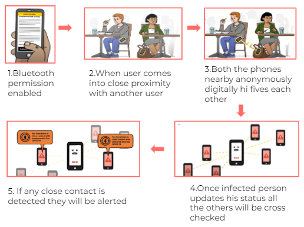
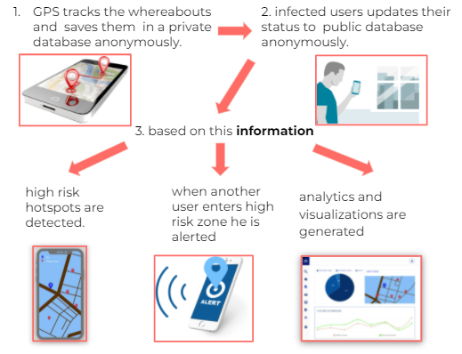
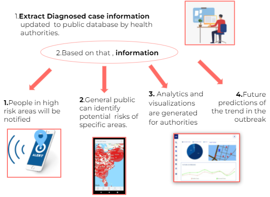
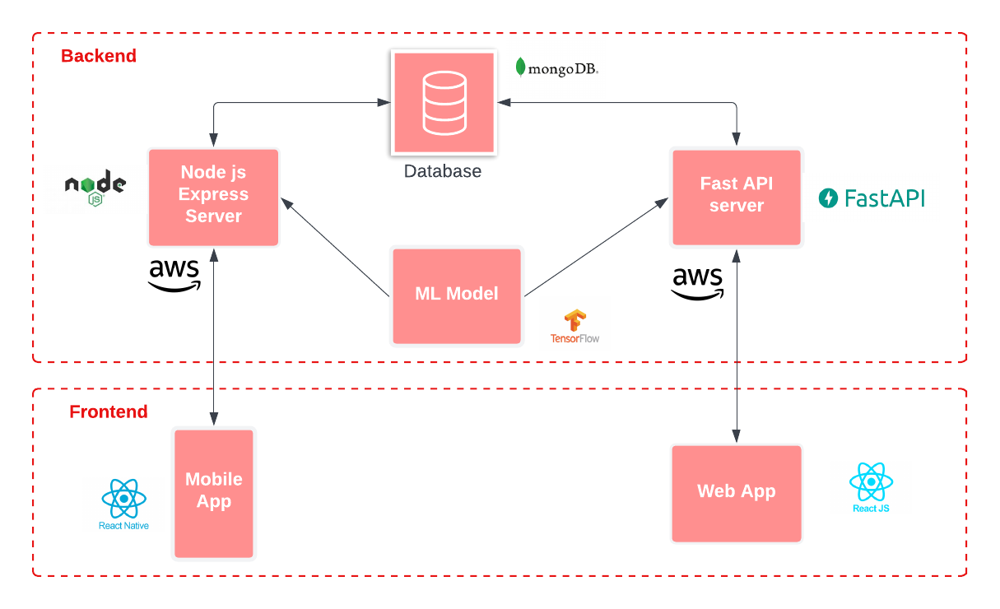
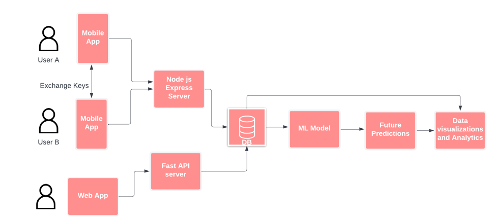
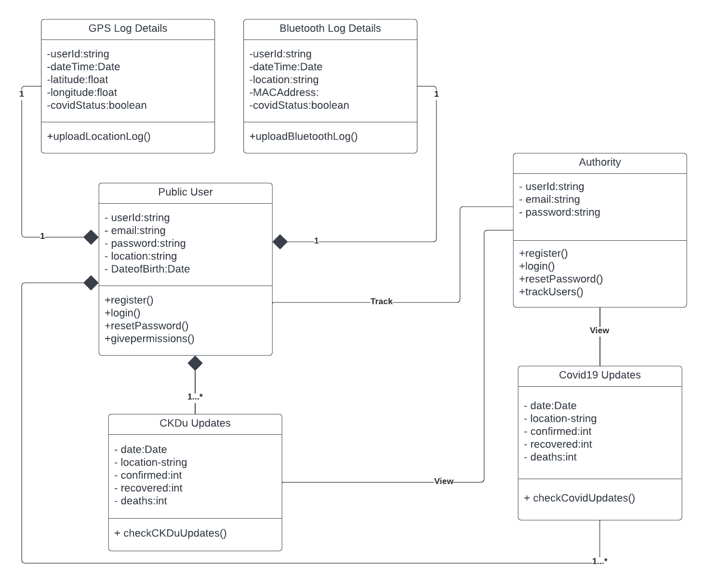
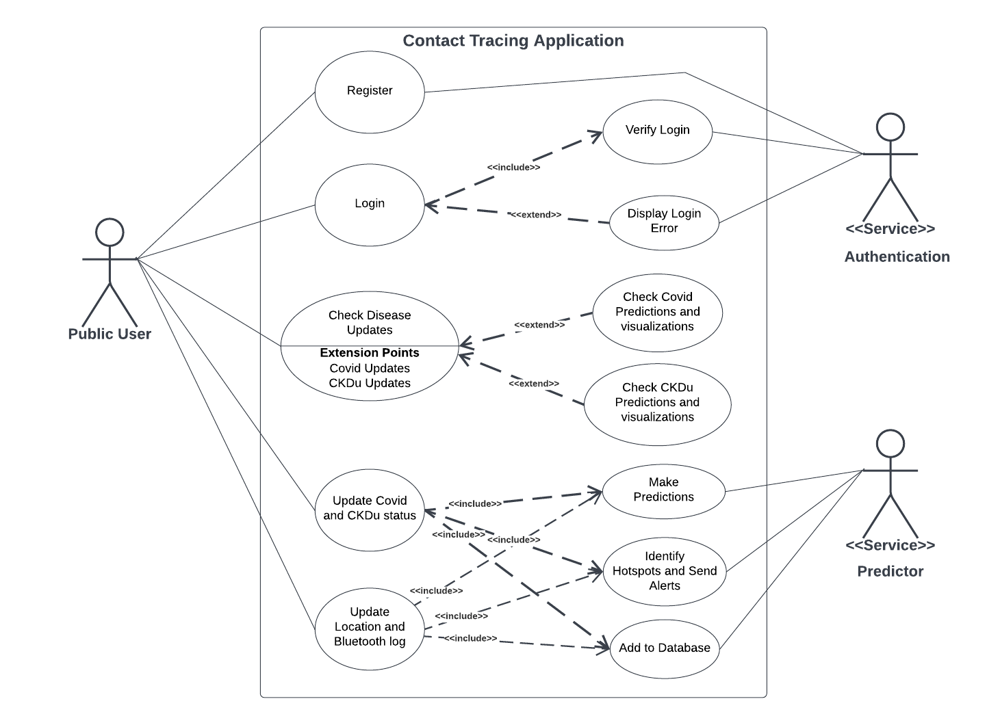
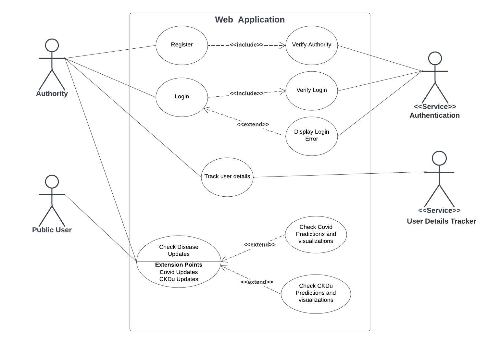
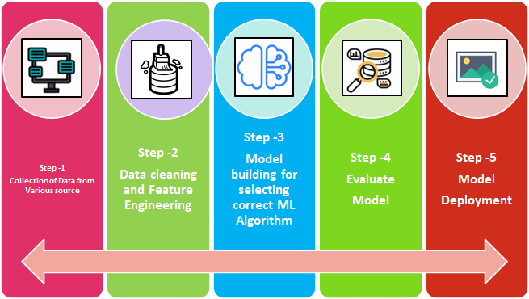

[comment]: # "This is the standard layout for the project, but you can clean this and use your own template"

#  CONTACT TRACING APP

## Table of Contents
- [CONTACT TRACING APP](#CONTACT-TRACING-APP)
  - [Table of Contents](#table-of-contents)
  - [Problem Overview](#problem-overview)
  - [Proposed System](#solution-overview)
  - [Team](#team)
  - [Links](#links)

## Problem Overview
PROBLEMS RELATED WITH COVID-19 ( Communicable disease )

- Inefficiency to trace the close contacts of an infected person manually.
- Not being able to know whether you've been in contact with an infected person.
- Lack of options to know whether a public place was visited by an infected person recently.

PROBLEMS RELATED WITH Chronic Kidney Disease/CKDu  ( Non-Communicable)

- Lack of awareness
- Difficulty in manually sorting  data to identify the spreading rates and trends.
- No efficient way to identify disease spreading hotspots/areas by the general public .

As a solution, we are proposing to build  a contact tracing mobile application as well as a web application.
We are planing to use both bluetooth and GPS to track down the contacts of the infected person.

## Solution Overview

### COVID19

To trace the close contacts Bluetooth is used.

To track the whereabouts (History of the locations visited) of the infected person GPS is used.

Using this GPS data, a proper dataset is created. Then this data set will be processed using data mining and machine learning techniques to provide the users with HIGH RISK ZONES on a map , Future predictions of the spread of the disease.

### Chronic kidney disease

Data of the infected people are uploaded by the health officials.
This dataset is then subjected to data mining and using machine learning techniques,
users are alerted when they enter a high risk zone and predictions are made for the third party authorities so that necessary precautions can be made to minimize the spread.

## Solution Architecture

## Data Flow

## Requirements

### Functional Requirements

-Administrative functions -Authorities have to login before using the web application to track user details 
-User Authentication -Users have to register before using the mobile application
-Permissions-Users should allow the application to track GPS and Bluetooth data
-Features
    -Users should update the covid status when the user is tested positive for the disease
    -Alert notifications 
    -User Questionnaires

### Non-Functional Requirements

-Usability
-Responsive user friendly features
-Reliability
    -Mobile application tracks user locations for every 15 seconds
-Performance
    -Realtime updates of maps and charts
    
## UML Class Diagram

## Use case Diagrams

### Mobile app

### Web app

## Machine Learning Proposal

### Communicable

-Based on the covid infection,recovery and death counts prediction in trends are made   (Forecast)
-Based on Geo-locations Hotspot identification and spreading rates are identified.
-Based on bluetooth data cluster formation and spread of the cluster is predicted.

### Non-Communicable

-Based on the infected , recovered and death counts of specific locations the trend in spread is predicted

## MACHINE LEARNING WORKFLOW

### 1.Data Gathering

#### Dataset : Userdetails with covid status/CKDu status

##### Communicable

-GPS coordinates of the user gathered every 15 seconds.
-Bluetooth UUIDs of the close contacts of the user.

##### Non-Communicable
-Locations of infected personals with infected recovered and death rates.

#### Proposed Mode of Data Collection :

Covid/CKDu status : Upon signing Up to the mobile app and routine questionnaires in case of close contact detection

##### Communicable

-Mobile Application collects the geo coordinates 
of the user in the foreground every 15 secs

-Mobile App collects the Bluetooth UUIDs when another device with the app comes in close proximity

##### Non-communicable

-PHI updates the infected,recovered and death counts with locations on a certain routine.

---

## Team
-  E/17/005, M.I Rishard , [e17005@eng.pdn.ac.lk](mailto:name@email.com)
-  E/17/379, S.P.D.D.S WEERASINGHE [e17379@eng.pdn.ac.lk](mailto:name@email.com)
-  E/17/327, A.M.F SHALHA, [e17327@eng.pdn.ac.lk](mailto:name@email.com)

## Links
<!-- - [Project Page](https://cepdnaclk.github.io/e17-3yp) -->
- [Project Repository](https://github.com/cepdnaclk/e17-co328-ContactTracingApp)
- [Project Page](https://cepdnaclk.github.io/e17-co328-ContactTracingApp/)
- [Department of Computer Engineering](http://www.ce.pdn.ac.lk/)
- [University of Peradeniya](https://eng.pdn.ac.lk/)

[//]: # (Please refer this to learn more about Markdown syntax)
[//]: # (https://github.com/adam-p/markdown-here/wiki/Markdown-Cheatsheet)
