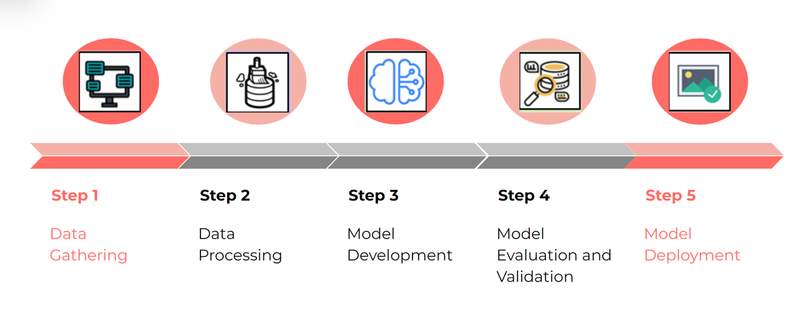

[comment]: # "This is the standard layout for the project, but you can clean this and use your own template"

# CONTACT TRACING APP

---

## Team
-  E/17/005,M.I RISHARD , [e17005@eng.pdn.ac.lk](mailto:name@email.com)
-  E/17/327, A.M.F SHALHA, [e17327@eng.pdn.ac.lk](mailto:name@email.com)
-  E/17/379, S.P.D.D.S WEERASINGHE, [e17379@eng.pdn.ac.lk](mailto:name@email.com)

## Table of Contents

  1. [Introduction](introduction)
  2. [Problem Overview](#problem-overview)
  3. [Solution Overview](#solution-overview)
  4. [Solution Architecture](#solution-architecture)
  5. [Data Flow](#data-flow)
  6. [Requirements Analysis](#requirements-analysis)
  7. [UML Class Diagram](#uml-class-diagram)
  8. [Use Case Diagrams](#use-case-diagrams)
  9. [Machine Learning Proposal](#machine-learning-proposal)
  10. [Machine Learning Workflow](#machine-learning-workflow)
   [Team](#team)
   [Links](#links)

---

## 1.Introduction

This is a contact tracing mobile application along with a web application to trace the the close contacts of covid 19 and chronic kidney disease infected persons.
GPS and Bluetooth technologies will be used to trace the contacts

## 2.Problem Overview
PROBLEMS RELATED WITH COVID-19 ( Communicable disease )

- Inefficiency to trace the close contacts of an infected person manually.
- Not being able to know whether you've been in contact with an infected person.
- Lack of options to know whether a public place was visited by an infected person recently.

PROBLEMS RELATED WITH Chronic Kidney Disease/CKDu  ( Non-Communicable)

- Lack of awareness
- Difficulty in manually sorting  data to identify the spreading rates and trends.
- No efficient way to identify disease spreading hotspots/areas by the general public .

As a solution, we are proposing to build  a contact tracing mobile application as well as a web application.
We are planing to use both bluetooth and GPS to track down the contacts of the infected person.

## 3.Solution Overview

### 3.1.COVID19

To trace the close contacts Bluetooth is used.

To track the whereabouts (History of the locations visited) of the infected person GPS is used.

Using this GPS data, a proper dataset is created. Then this data set will be processed using data mining and machine learning techniques to provide the users with HIGH RISK ZONES on a map , Future predictions of the spread of the disease.

### 3.2.Chronic kidney disease

Data of the infected people are uploaded by the health officials.
This dataset is then subjected to data mining and using machine learning techniques,
users are alerted when they enter a high risk zone and predictions are made for the third party authorities so that necessary precautions can be made to minimize the spread.

## 4.Solution Architecture

## 5.Data Flow

## 6.Requirements Analysis

### 6.1.Functional Requirements

System should be able to trace close contacts of an infected person.

#### Mobile application
   - Should get gps and bluetooth tracking permission 
   - Should be able to display covid 19 and CKDu updates.
   - Should send alert notifications when risk detected
   - Should be able to get covid status through the app

#### Web app 
   - Should allow authorities to track user details
   - Should allow public users to check covid 19 and ckdu updates.

### 6.2.Non-Functional Requirements

#### Usability
- Responsive user friendly UI
    
#### Reliability
- Tracks user locations for every 15 seconds
  
#### Performance
- Realtime updates of maps and charts

    
## 7.UML Class Diagram

## 8.Use case Diagrams

### 8.1.Mobile app

### 8.2.Web app

## 9.Machine Learning Proposal

### Communicable

-Based on the covid infection,recovery and death counts prediction in trends are made   (Forecast)
-Based on Geo-locations Hotspot identification and spreading rates are identified.
-Based on bluetooth data cluster formation and spread of the cluster is predicted.

### Non-Communicable

-Based on the infected , recovered and death counts of specific locations the trend in spread is predicted

## 10.MACHINE LEARNING WORKFLOW

### 10.1.Data Gathering

#### Dataset : User details with covid status/CKDu status

##### Communicable

- GPS coordinates of the user gathered every 15 seconds.
- Bluetooth UUIDs of the close contacts of the user.

##### Non-Communicable
- Locations of infected personals with infected recovered and death rates.

#### Proposed Mode of Data Collection :

Covid/CKDu status : Upon signing Up to the mobile app and routine questionnaires in case of close contact detection

##### Communicable

- Mobile Application collects the geo coordinates of the user in the foreground every 15 secs

- Mobile App collects the Bluetooth UUIDs when another device with the app comes in close proximity

##### Non-communicable

- PHI updates the infected,recovered and death counts with locations on a certain routine.

## Links
<!-- - [Project Page](https://cepdnaclk.github.io/e17-3yp) -->
- [Project Repository](https://github.com/cepdnaclk/e17-co328-ContactTracingApp)
- [Project Page](https://cepdnaclk.github.io/e17-co328-ContactTracingApp/)
- [Department of Computer Engineering](http://www.ce.pdn.ac.lk/)
- [University of Peradeniya](https://eng.pdn.ac.lk/)

[//]: # (Please refer this to learn more about Markdown syntax)
[//]: # (https://github.com/adam-p/markdown-here/wiki/Markdown-Cheatsheet)
